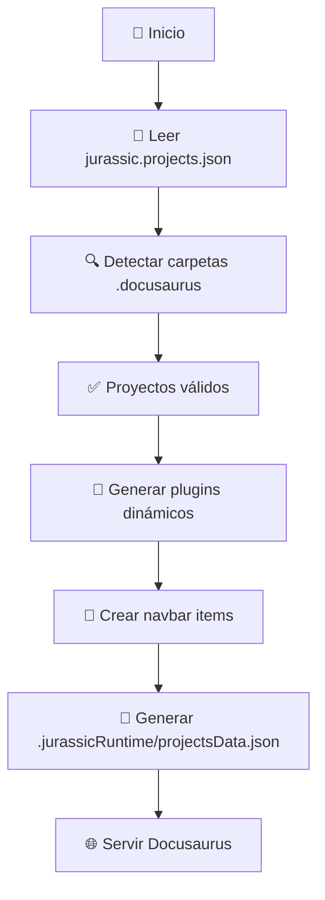

# 🏗️ Arquitectura

Explicación técnica de cómo Jurassic Docs maneja la agregación dinámica de proyectos.

## 🔧 Componentes clave

### 1. 📄 Configuración de proyectos

```json title="jurassic.projects.json"
{
  "projects": [
    "../scripts-devtools",
    "project-examples/project-alpha",
    "../other-project"
  ]
}
```

### 2. 🔍 Detección automática

Para cada ruta de proyecto, Jurassic Docs:

1. ✅ Busca `.docusaurus/docs/` (prioritario)
2. ✅ Si no existe, busca `.docusaurus/markdown/`
3. ❌ Si ninguno existe, ignora el proyecto

### 3. 🎛️ Generación de plugins

```javascript
// Cada proyecto válido se convierte en un plugin @docusaurus/plugin-content-docs
const docsPlugins = validProjects.map(project => [
  '@docusaurus/plugin-content-docs',
  {
    id: `jurassic-${slugify(projectName)}`,
    path: project.detectedFolder,
    routeBasePath: slugify(projectName),
    include: ['**/*.md', '**/*.mdx'],
    sidebarPath: require.resolve('./sidebars.js'),
  }
]);
```

## 🌊 Flujo de ejecución



## 📂 Estructura esperada por proyecto

```
mi-proyecto/
└── .docusaurus/
    └── docs/           # ← Prioritario
        ├── intro.md
        ├── guide.md
        └── api/
            └── reference.md
```

O alternativamente:

```
mi-proyecto/
└── .docusaurus/
    └── markdown/       # ← Fallback
        ├── overview.md
        └── setup.md
```

## 🎯 Ventajas del diseño

- **🔄 Dinámico**: Sin reconfiguración manual al añadir proyectos
- **🛡️ Aislado**: Plugin separado = sin colisiones de IDs
- **📱 Escalable**: Funciona con N proyectos
- **🎨 Consistente**: Sidebar único reutilizado
- **⚡ Eficiente**: Solo carga proyectos válidos
